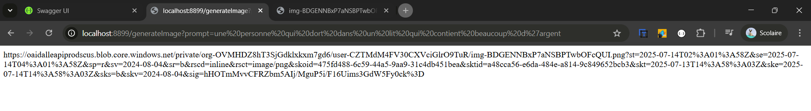
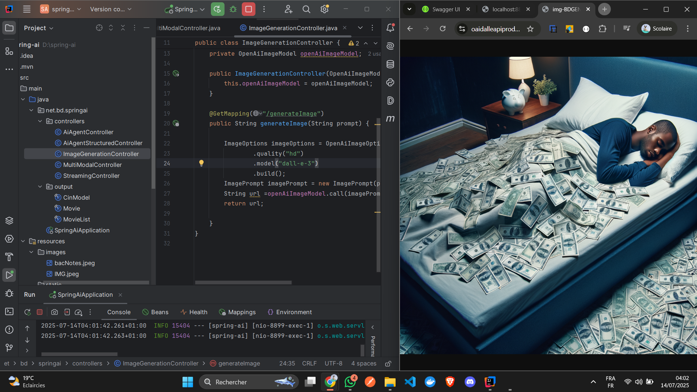
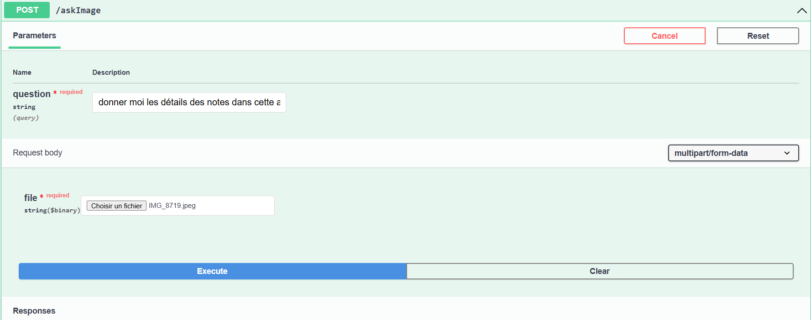
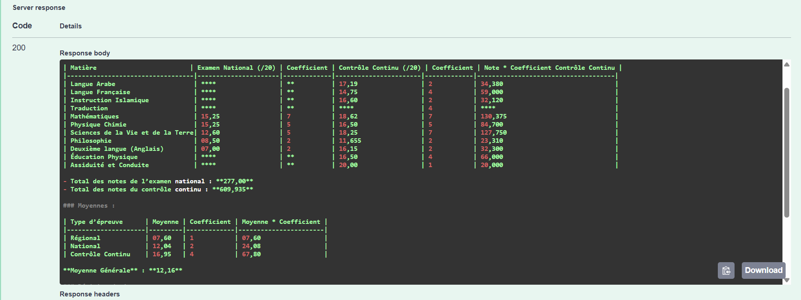

# 🤖 Prompt Engineering et Intégration avec l’IA

## 🎯 Objectif de l’activité pratique

Créer un projet Spring Boot intégrant :
- Un **chatbot** basé sur les modèles LLM **GPT-4o** (via OpenAI) et **LLaMA 3.2** (via Ollama)
- Un **générateur d’images** à partir de prompts texte, utilisant **DALL·E 3**

## 🛠️ Technologies et dépendances

| Technologie         | Usage principal                                |
|---------------------|-------------------------------------------------|
| Spring Boot         | Backend principal du projet                     |
| Spring Web          | Création d'API REST                             |
| Spring Data JPA     | Persistance des données                         |
| H2 Database         | Base de données en mémoire                      |
| Lombok              | Réduction du code boilerplate                   |
| Spring AI           | Connexion avec OpenAI et Ollama (LLM + images) |
| Swagger UI          | Interface de test des APIs                     |
| OpenAI / DALL·E     | Génération de réponses textuelles & visuelles  |

---

## ⚙️ Prérequis

- Java 17+
- Maven
- Docker (pour Ollama)
- Clé API OpenAI
- Ollama installé localement (et `llama3.2` téléchargé)

---

## 📸 Captures d’écran

### 🖼️ 1. Prompt dans url pour genere l'image



---

### 🧠 2. Résultat d’image générée par DALL·E 3



---

### 🖼️ 3. Prompt Swagger vers image pour lire est afficher le contenu de l'image Notes ext ..



---

### 🖼️ 4. Les Resultats 



---
## 📁 Structure du Projet
```
📦 springAI-demo
├── 📁 controllers
│ ├── 📄 AiAgentController.java
│ ├── 📄 AiAgentStructuredController.java
│ ├── 📄 ImageGenerationController.java
│ ├── 📄 MultiModalController.java
│ └── 📄 StreamingController.java
├── 📁 output
│ ├── 📄 CinModel.java
│ ├── 📄 Movie.java
│ ├── 📄 MovieList.java
├── 📄 SpringAiApplication.java
├── 📁 resources
│ └── 📁 images

```
---
## 🚀 Lancement du projet

```bash
# Cloner le dépôt
git clone https://github.com/ton-compte/spring-ai-chatbot.git
cd spring-ai-chatbot

# Lancer le serveur Ollama (si besoin)
ollama run llama3.2
```
